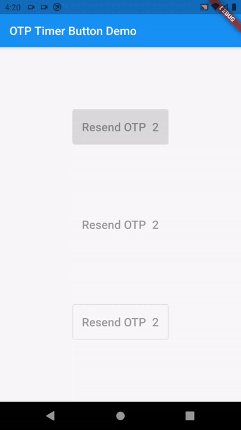
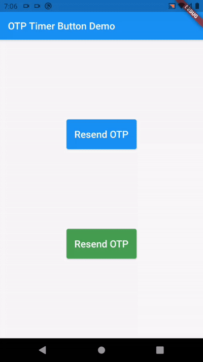

# otp_timer_button

This is a Flutter package for easy implementation otp timer button.

   

## Installation

Add the following to your pubspec.yaml file:

```yaml
dependencies:
    otp_timer_button: ^1.0.0
```

## Usage

### Import

```dart
import 'package:otp_timer_button/otp_timer_button.dart';
```

### Simple Example

```dart
OtpTimerButtonController controller = OtpTimerButtonController();

@override
Widget build(BuildContext context) {
    return Scaffold(
      appBar: AppBar(
        title: Text(widget.title),
      ),
      body: Center(
        child: OtpTimerButton(
          controller: controller,
          onPressed: () {},
          text: Text('Resend OTP'),
          duration: 60,
        ),
      ),
    );
}
```