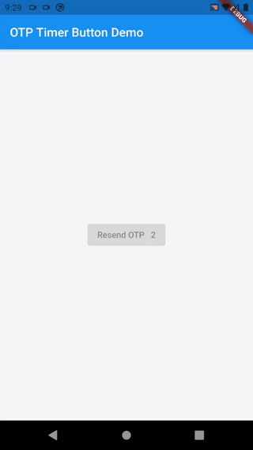

# otp_timer_button

This is a Flutter package for easy implementation otp timer button.

 

## Installation

Add the following to your pubspec.yaml file:

```yaml
dependencies:
    otp_timer_button: ^1.1.0
```

## Usage

### Import

```dart
import 'package:otp_timer_button/otp_timer_button.dart';
```

### Simple Example

```dart
OtpTimerButtonController controller = OtpTimerButtonController();

@override
Widget build(BuildContext context) {
    return Scaffold(
      appBar: AppBar(
        title: Text(widget.title),
      ),
      body: Center(
        child: OtpTimerButton(
          controller: controller,
          onPressed: () {},
          text: Text('Resend OTP'),
          duration: 60,
        ),
      ),
    );
}
```

### Controller

If you want to wait for the response to the OTP request, you can use the controller:

NOTE: if use controller, auto start timer is disabled on pressed button.

```dart
  OtpTimerButtonController controller = OtpTimerButtonController();

  _requestOtp() {
    controller.loading();
    Future.delayed(Duration(seconds: 2), () {
      controller.startTimer();
    });
  }

  @override
  Widget build(BuildContext context) {
    return Scaffold(
      appBar: AppBar(
        title: Text(widget.title),
      ),
      body: Center(
        child: OtpTimerButton(
          controller: controller,
          onPressed: () => _requestOtp(),
          text: Text('Resend OTP'),
          duration: 2,
        ),
      ),
    );
  }
```



```dart
controller.startTimer();
controller.loading();
controller.enableButton();
```